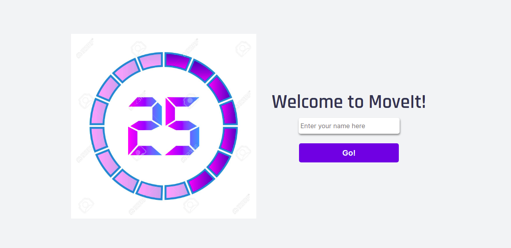
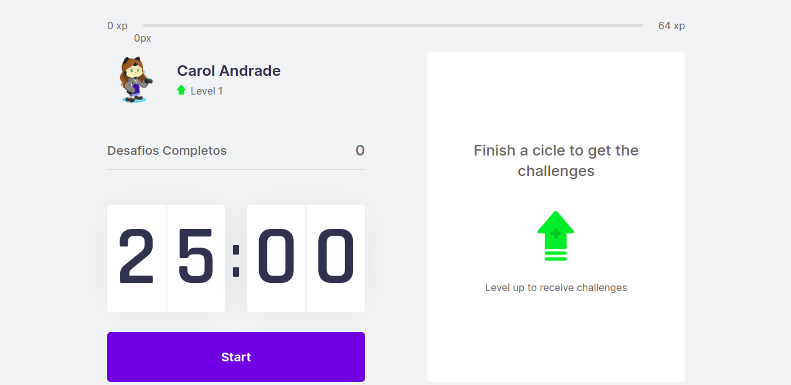

This is a [Next.js](https://nextjs.org/) project bootstrapped with [`create-next-app`](https://github.com/vercel/next.js/tree/canary/packages/create-next-app).

## Getting Started

## https://movi-it.vercel.app/

### Desktop 

 <> 

### Application

This is a based method Pomodoro app.
After 25min, you will get a challenge to improve your performance. It can be an exercise for your hole body or special parts of it.

### Tech
- ReactJs
- NextJs
- TypeScript
